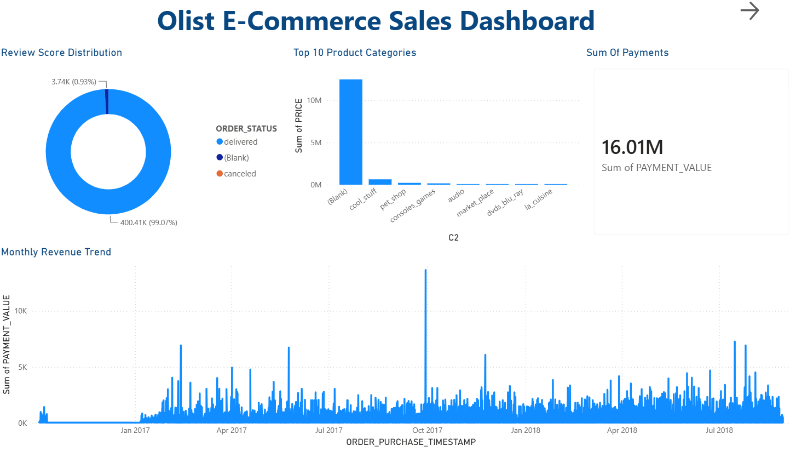
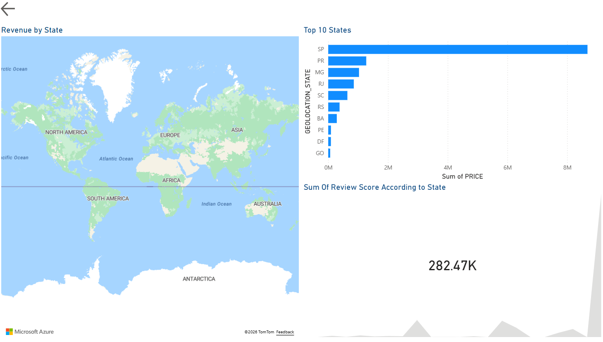
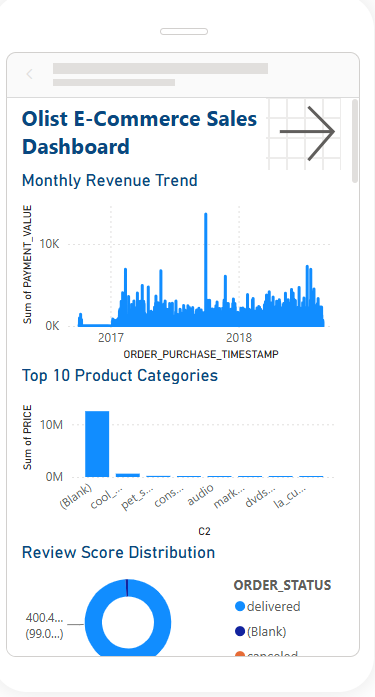
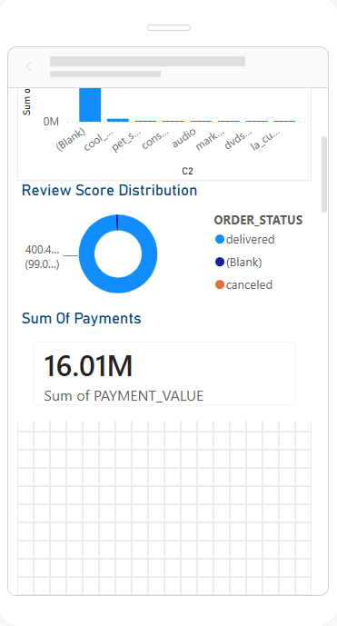
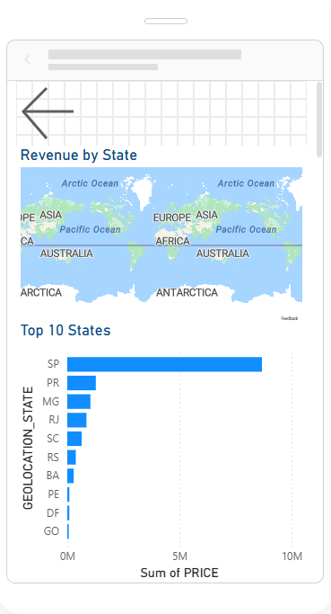
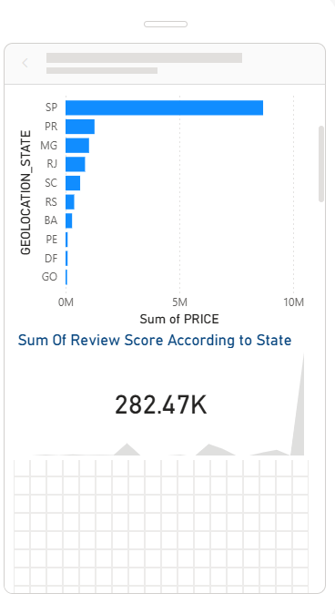
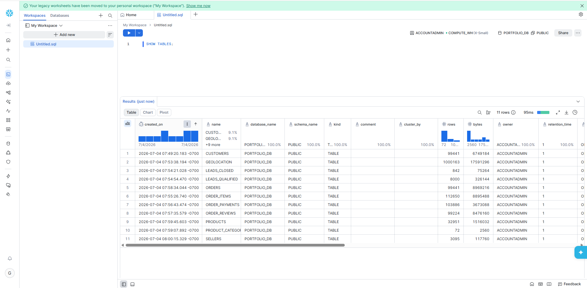
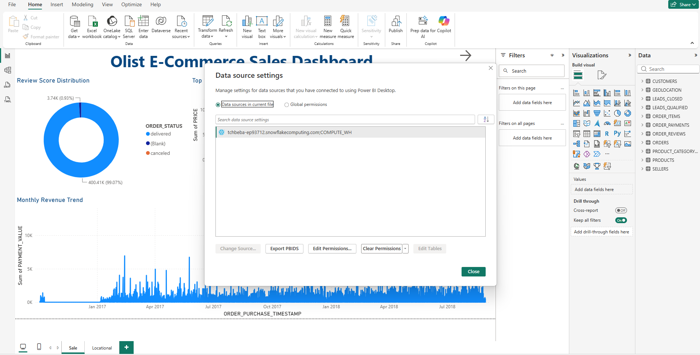

# Olist E-Commerce Analytics | Snowflake & Power BI

An end-to-end analytics project built with the Brazilian Olist e-commerce dataset. The work covers data preparation, cloud warehousing in Snowflake, SQL analysis, Power BI reporting and publication to Power BI Service.

## Project Scope

- Prepared Olist source tables for analytical use.
- Loaded and validated the data in Snowflake.
- Used SQL to join, aggregate and analyze customer, order, product, seller, payment and review data.
- Built an interactive Power BI report with KPI, time, geographic, product and review views.
- Configured the Snowflake connection for Power BI Service.

## Technologies

- Snowflake
- SQL
- Power BI Desktop and Power BI Service
- Python and SQLite during data preparation
- Git and GitHub

## Analytical Coverage

The report supports analysis of:

- Revenue and order trends over time
- Revenue by state
- Product-category performance
- Customer-review patterns
- Geographic distribution
- Mobile report consumption

## Evidence in This Repository

```text
olist-snowflake-powerbi-analytics/
├── SnowflakeProject.pbix
├── screenshots/
│   ├── first.png
│   ├── second.png
│   ├── third.png
│   ├── fourth.png
│   ├── fifth.png
│   ├── sixth.png
│   ├── seventh.png
│   └── eighth.png
└── README.md
```

The current repository contains the final Power BI file and implementation screenshots. Earlier versions of this README listed Python and SQL source folders that were not actually committed; those unsupported file references have been removed.

## Project Screenshots

### Project view 1


### Project view 2


### Project view 3


### Project view 4


### Project view 5


### Project view 6


### Project view 7


### Project view 8


## Skills Demonstrated

- Data preparation and validation
- Relational SQL analysis
- Cloud data warehousing
- Data modeling
- Power Query and DAX
- KPI and dashboard design
- Power BI Service deployment

## Limitation and Next Improvement

The repository currently demonstrates the finished analytical output but is not fully reproducible because the preparation and SQL scripts are not committed. The next technical improvement should be to add sanitized source code, a data dictionary and representative SQL queries without exposing credentials.
