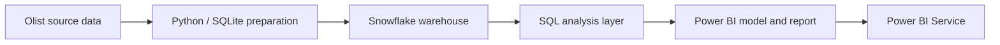

# Olist E-Commerce Analytics | Snowflake & Power BI

An end-to-end analytics portfolio prototype using the Brazilian Olist e-commerce dataset. The project covers data preparation, Snowflake loading, SQL-oriented analysis, Power BI reporting, and Power BI Service deployment.

> **Portfolio status:** The cloud and reporting workflow is demonstrated, but the repository is not yet fully reproducible and the current report still has documented QA items. I publish those limitations explicitly rather than presenting prototype output as production-ready analysis.

## Business Question

How can an e-commerce team monitor order value, category performance, customer reviews, geographic patterns, and delivery activity from a shared analytical model?

## Workflow


```mermaid
flowchart LR
    A["Olist source data"] --> B["Python / SQLite preparation"]
    B --> C["Snowflake warehouse"]
    C --> D["SQL analysis layer"]
    D --> E["Power BI model and report"]
    E --> F["Power BI Service"]
```

## Work Completed

- Prepared relational Olist tables for analytical use.
- Loaded and validated source tables in Snowflake.
- Connected Power BI Desktop to the Snowflake warehouse.
- Built report pages for payment value, time trends, product categories, order status, and state-level analysis.
- Created a mobile report layout and prepared the report for Power BI Service.

## Evidence in This Repository

```text
olist-snowflake-powerbi-analytics/
SnowflakeProject.pbix
screenshots/
first.png
second.png
third.png
fourth.png
fifth.png
sixth.png
README.md
```

The repository currently contains the Power BI artifact and report screenshots. Python and SQL source files are not committed, so the pipeline cannot yet be reproduced from this repository alone.

## Data Sources and Attribution

- Original dataset: [Brazilian E-Commerce Public Dataset by Olist](https://www.kaggle.com/datasets/olistbr/brazilian-ecommerce), published under **CC BY-NC-SA 4.0**.
- SQLite conversion used during preparation: [E-commerce dataset by Olist (SQLite)](https://www.kaggle.com/datasets/terencicp/e-commerce-dataset-by-olist-as-an-sqlite-database), published under **CC BY-NC 4.0**.

The source dataset is not redistributed in this repository. Refer to the linked dataset pages for attribution and usage terms.

## Technical Review

The current report is a learning prototype, not a production dashboard. A quality review identified the following work before any metric should be used operationally:

- Reconcile fact-table relationships and measures against source row counts.
- Resolve blank product categories before ranking category performance.
- Correct visual titles so they match the dimensions and measures displayed.
- Replace state abbreviations with a reliable Brazil geography lookup for mapping.
- Validate desktop and mobile layouts after the model corrections.
- Add sanitized Python and SQL source, a data dictionary, and a relationship diagram.

## Next Iteration

1. Rebuild and validate the semantic model at the correct grain.
2. Add reviewable `scripts/` and `sql/` source without credentials.
3. Document representative DAX measures and validation queries.
4. Replace the prototype screenshots with a concise, recruiter-ready report gallery.

## Technologies

Snowflake | SQL | Python | SQLite | Power BI Desktop | Power BI Service

